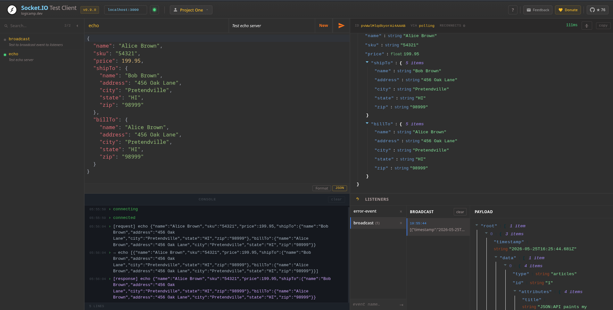
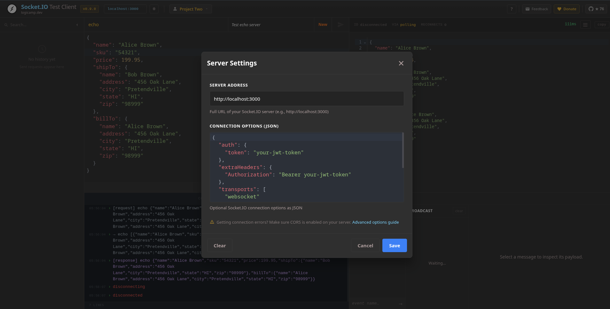
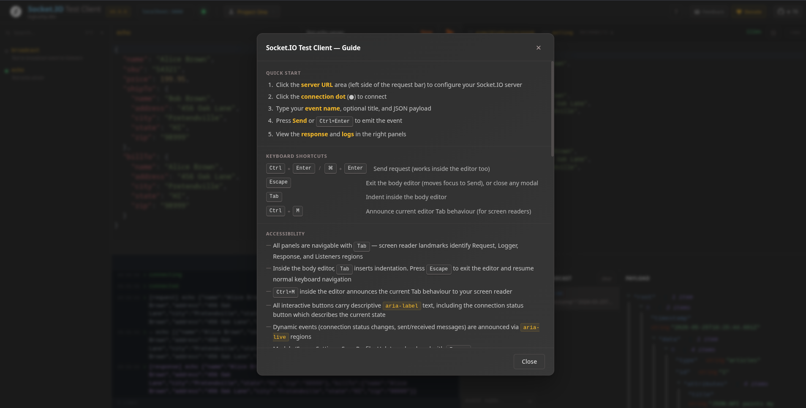

# Socket.IO Test Client

A developer tool for testing Socket.IO APIs. Connect to any Socket.IO server, emit events with JSON payloads, capture real-time responses, and manage server profiles — all from a clean dark UI.

Available as a **web app** and **browser extension** (Chrome, Firefox).



---

## Installation

### Arch Linux (AUR)

```bash
yay -S socketio-test-client
socketio-test-client          # opens on http://localhost:8888
```

### npm / pnpm

```bash
pnpm add -g socketio-test-client
socketio-test-client          # opens on http://localhost:8888
```

### Local development

```bash
pnpm install
pnpm dev                      # opens on http://localhost:5173
```

### Browser extensions

- [Chrome Web Store](https://chrome.google.com/webstore/detail/socketio-test-client/ophmdkgfcjapomjdpfobjfbihojchbko?hl=en)
- [Firefox Add-ons](https://addons.mozilla.org/en-US/firefox/addon/socketio-client/)

---

## Usage

### 1. Connect to a server

Click **Set URL**, enter your Socket.IO server address (e.g. `http://localhost:3000`), and optionally set a custom path or pass advanced options as JSON:



```json
{
  "auth": { "token": "your-jwt-token" },
  "extraHeaders": { "Authorization": "Bearer your-jwt-token" },
  "transports": ["websocket"]
}
```

Then press **Connect**. The status indicator updates in real time and connection details (socket ID, transport, uptime) appear in the response panel.

### 2. Send an event

1. Enter an **event name** (e.g. `chat:message`)
2. Enter an optional **title** to save it in history
3. Write the **JSON body** in the editor
4. Press **Send** or `Ctrl+Enter`

The response and round-trip duration appear immediately on the right.

### 3. Listen for server-pushed events

Register event names in the **Listeners** panel to capture broadcasts in real time. Each message is displayed in a JSON tree and can be exported.

### 4. Browse history

Past requests auto-save by title. Use the **History** panel to search, reopen, and replay previous requests instantly.

### 5. Manage profiles

Save server configurations as named profiles (Dev, Staging, Production) and switch between them without re-entering connection details.



---

## Keyboard Shortcuts

| Shortcut | Action |
|---|---|
| `Ctrl+Enter` | Send the current request |
| `Tab` | Indent inside the body editor |
| `Shift+Tab` | Outdent inside the body editor |

---

## Export & Import

Click **Export** to download your session (history + listeners + profiles) as a timestamped JSON file. Share with teammates or archive for later.

Click **Import** to restore a previously exported session.

---

## Testing

```bash
pnpm test           # unit + integration tests (Vitest)
pnpm test:e2e       # end-to-end tests (Playwright)
pnpm test:all       # everything
```
